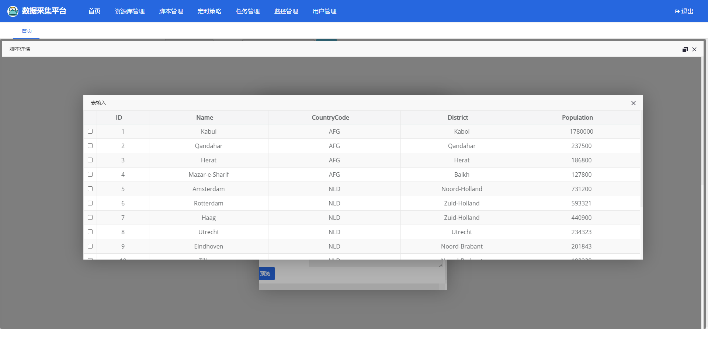

# kettle-scheduler-boot

## Development Plan

|Serial Number|Item|Status|Priority|
|----|----|----|----|
|1|Online management, edit kettle script |✔|Emergency|
|2|Cluster through source code, multi-threaded execution of tasks |✔|Urgent|
|2|Refactor the jpa part and change it to mybatis|✔|General|

#### Introduction
The kettle scheduling project based on Spring-boot, refer to the code of [zhaxiaodong9860](https://github.com/zhaxiaodong9860) and reference the page management in it, and the back-end code refers to the API for tool-based writing, which is convenient to use
Add the following functions to the original code
1. Modify the database to oracle
2. Increase mybatis related dependencies and replace jpa with mybatis one after another
3. Add parameters to the kettle script for dynamic scripting
4. Delete the conversion name and do not allow duplicate constraints
5. Added conversion description display on the page
6. Added some extended functions
7. Add online editing script

#### Demo environment
[Click to view the demo environment](http://kettle.35youth.cn)
Account: demo
Password: demo@1234
**Demonstration environment, please be kind. **

[Click to download the executable package](https://pan.baidu.com/s/1xnd2bYZ_3cZGmSm4azg8iw) Extraction code: e150

#### [Click to view the complete update record](./docs/md/update.md)
**2020-12-17 update instructions**
1. [New] Add table to input preview data
   
   Data preview

#### [Known Bug List](./docs/md/Bug.md)

#### Project screenshot


**<centeer>Screenshot of login page</center>**


**<centeer>Homepage screenshot (updated style)</center>**


**New conversion task (updated style)**   
Add page transfer parameters for conversion tasks, and manually write data in json format   
The trans_params field is added to the k_trans table of the database, and the corresponding entity class also needs to be added. When the task is executed, the parameters are obtained from the trans and set to the corresponding script

```java
//className org.kettle.scheduler.system.biz.quartz.TransQuartz

@Override
public void execute(JobExecutionContext jobExecutionContext) throws JobExecutionException {
...........
Integer transId = jobExecutionContext.getMergedJobDataMap().getInt("id");
// Get conversion
Trans trans = transService.getTransById(transId);
// Set execution parameters
Map<String, String> params = new HashMap<>(2);
String transParams = trans.getTransParams();
Map jsonToMap = JSON.parseObject(transParams);
params.putAll(jsonToMap);
if (StringUtil.hasText(trans.getSyncStrategy())) {
Integer day = Integer.valueOf(trans.getSyncStrategy().substring(2, trans.getSyncStrategy().length()));
params.put("start_time", DateUtil.getDateTimeStr(DateUtil.addDays(DateUtil.getTodayStartTime(), -day)));
params.put("end_time", DateUtil.getDateTimeStr(DateUtil.addDays(DateUtil.getTodayEndTime(), -day)));
}
.........
}

```


**Online editing kettle script tool, the same usage as kettle on desktop**   
Project address: https://github.com/HiromuHota/pentaho-kettle
Resource library dictionary: https://35youth.cn/kettleRepository.html

#### Installation tutorial
1. Import the 1_XXX.sql 2_XXX, 3_XXX files in the docs to the oracle database

#### Instructions for use
1. Execute the kettle-scheduler-oracle.sql script under docs under kettle-scheduler-starter to create a table

2. Modify the database connection configuration in application-prod.yml when the generation environment is executed, and modify the database configuration in application-dev.yml in the development environment. If you need to modify the port, modify it in application.yml

3. Modify the application-kettle.yml configuration, set the log storage path, the kettle script storage path, and the kettle-home path (if the home path is not specified, the .kettle folder is under the current user root path)

4. If you need to write custom variables in kettle.properties, and copy the kettle.properties file to the .kettle folder under the kettle-home path

5. Start the project to use the scheduling platform (user name: admin, password: admin)

6. If you want to use [File Resource Library], you need to copy [file-rep] under the project separately to the set path, and configure the file resource library on the management page, because after packaging, kettle cannot access the files in the jar. So it needs to be stored separately

#### Participate in Contribution

1. Fork this warehouse
2. Create new Feat_xxx branch
3. Submit the code
4. New Pull Request

#### about me
1. a half-size farmer
   