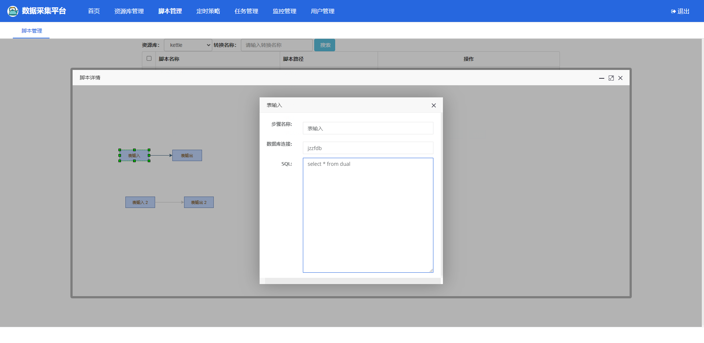

# kettle-scheduler-boot
    
## 开发计划

|序号|项目|状态|优先级|
|----|----|----|----|
|1|在线管理，编辑kettle脚本 |✔|紧急|
|2|通过源码实现集群，多线程执行任务 |✔|紧急|
|2|重构jpa部分，改为mybatis|✔|一般|

#### 介绍
基于Spring-boot的kettle调度项目，参考了[zhaxiaodong9860](https://github.com/zhaxiaodong9860)的代码并引用了其中的页面管理，后台代码自行参考了API进行工具化编写，方便使用   
在原代码的基础上加入以下功能   
1、修改数据库为oracle   
2、增加mybatis相关依赖，陆续将jpa替换为mybatis   
3、增加向kettle脚本中传递参数，用于动态化脚本   
4、删除转换名不允许重复约束   
5、页面上增加转换描述显示   
6、增加了一些扩展功能   
7、增加在线编辑脚本   

#### [点击查看完整更新记录](./docs/md/update.md) 
**2020-11-30 更新说明**  
1、【优化】完善脚本在线预览功能（持续完善中）   

在线预览脚本 

#### [已知Bug列表](./docs/md/Bug.md)

#### 项目截图


 **<centeer>登录页截图</center>** 


 **<centeer>首页截图(已更新风格)</center>** 


 **<centeer>新增转换任务(已更新风格)</center>   ** 
转换任务增加页面传递参数，手动写json格式的数据 
数据库k_trans表中增加trans_params字段，对应的实体类中也需要增加，通过执行任务时，从trans中获取参数，并设置到相应的脚本中
 
```java
//className  org.kettle.scheduler.system.biz.quartz.TransQuartz

@Override
public void execute(JobExecutionContext jobExecutionContext) throws JobExecutionException {
...........
Integer transId = jobExecutionContext.getMergedJobDataMap().getInt("id");
// 获取转换
Trans trans = transService.getTransById(transId);
// 设置执行参数
Map<String, String> params = new HashMap<>(2);
String transParams = trans.getTransParams();
Map jsonToMap = JSON.parseObject(transParams);
params.putAll(jsonToMap);
if (StringUtil.hasText(trans.getSyncStrategy())) {
	Integer day = Integer.valueOf(trans.getSyncStrategy().substring(2, trans.getSyncStrategy().length()));
	params.put("start_time", DateUtil.getDateTimeStr(DateUtil.addDays(DateUtil.getTodayStartTime(), -day)));
	params.put("end_time", DateUtil.getDateTimeStr(DateUtil.addDays(DateUtil.getTodayEndTime(), -day)));
}
............
}

```

   
**在线编辑kettle脚本工具，和桌面端的kettle一样用法**    
项目地址：https://github.com/HiromuHota/pentaho-kettle   
资源库字典：https://35youth.cn/kettleRepository.html

#### 安装教程
1、导入docs中的1_XXX.sql 2_XXX、3_XXX文件至oracle数据库   

#### 使用说明
1.  执行kettle-scheduler-starter下面docs下面的kettle-scheduler-oracle.sql脚本创建表

2.  生成环境执行时修改application-prod.yml中的数据库连接配置，开发环境修改application-dev.yml中的数据库配置，如果需要修改端口就在application.yml中修改

3.  修改application-kettle.yml配置，设置日志存储路径、kettle脚本保存路径、kettle-home路径（如果没有指定home路径，那么.kettle文件夹就在当前用户根路径下）

4.  如果需要自定义变量在kettle.properties中编写，并把kettle.properties文件拷贝到kettle-home路径下面的.kettle文件夹下

5.  启动项目使用调度平台(用户名：admin，密码：admin)

6.  如果要使用【文件资源库】需要单独把项目下【file-rep】拷贝到设置好的路径下，并在管理页面配置好文件资源库，因为打包后kettle不能访问到jar中的文件，所以需要单独存放

#### 参与贡献

1.  Fork 本仓库
2.  新建 Feat_xxx 分支
3.  提交代码
4.  新建 Pull Request

#### 关于我
1.  半码农


