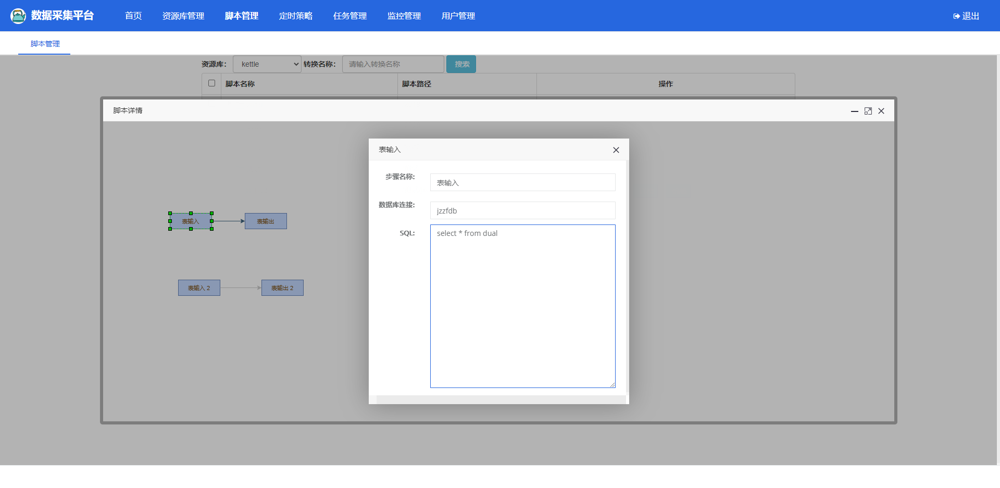

# kettle-scheduler-boot
    
## 更新记录

**2020-12-16 更新说明**  
1、【优化】完善脚本在线预览功能，增加表输出预览（持续完善中）   

在线预览脚本

**2020-11-30 更新说明**  
1、【优化】完善脚本在线预览功能（持续完善中）   

在线预览脚本  

**2020-11-29 更新说明**  
1、【新功能】引入Mxgraph.js，初步完成脚本在线预览功能（持续完善中）   

在线预览脚本  

**2020-11-27 更新说明**  
1、【优化】完善脚本管理中返回转换中属性（工作量巨大）   
2、【计划】引入Mxgraph.js完成在线编辑脚本功能 

转换详情接口返回数据格式   


Mxgraph.js插件   
**2020-11-22 更新说明**  
1、【优化】新增、编辑转换页面参数维护功能
 

 **2020-11-21 重要更新说明**  
1、增加读取资源库脚本，并获取脚本详情功能（获取详情暂未完成,跪求一名前端大佬助力）
 

 **2020-06-15 重要更新说明**  
 1、修改日志级别BUG，TransMate中设置日志级别不生效，将日志级别设置到Trans中    
 2、同一个脚本，同时运行，根据日志ID获取日志会有一个BUG，日志ID根据转换名称计算得来的，针对同一转换，不同参数手动设置LogChannel 中的名称参数   

 **2020-06-05 重要更新说明**   
 修改页面风格   
 
<centeer> **首页截图** </center>
 
 
<centeer> **转换任务页面** </center>   
 **2020-05-13 重要更新说明**    
由于原代码数据库使用的是mysql，所有ID使用的是数据库自增长ID，迁移到oracle后，将自增长ID修改为触发器，目前根据使用到的实体类，创建了相应的序列及触发器，按照SEQ_TRANS及TRANS_TRIGGER去创建即可。   
| 序列列表 | 触发器列表 |   
| ------ | ------ |   
| SEQ_CATEGORY | CATEGORY_TRIGGER |   
| SEQ_DATABASE_TYPE | DATABASE_TYPE_TRIGGER |   
| SEQ_JOB_MONITOR | JOB_MONITOR_TRIGGER |   
| SEQ_JOB_RECORD | JOB_RECORD_TRIGGER |   
| SEQ_JOB | JOB_TRIGGER |   
| SEQ_QUARTZ | QUARTZ_TRIGGER |   
| SEQ_REPOSITORY | REPOSITORY_TRIGGER |   
| SEQ_TRANS_MONITOR | TRANS_MONITOR_TRIGGER |   
| SEQ_TRANS_RECORD | TRANS_RECORD_TRIGGER |   
| SEQ_TRANS | TRANS_TRIGGER |   
| SEQ_USER | USER_TRIGGER |  
 
**序列创建语句**
-- ----------------------------
 Sequence structure for SEQ_TRANS
 ```sql
DROP SEQUENCE "KETTLE_SCHEDULER"."SEQ_TRANS";
 CREATE SEQUENCE "KETTLE_SCHEDULER"."SEQ_TRANS" MINVALUE 1 MAXVALUE 99999999 INCREMENT BY 1 CACHE 20;
 ```
-- ----------------------------
**触发器创建语句**
-- ----------------------------
Triggers structure for table K_TRANS
```sql
CREATE TRIGGER "KETTLE_SCHEDULER"."TRANS_TRIGGER" BEFORE INSERT ON "KETTLE_SCHEDULER"."K_TRANS" REFERENCING OLD AS "OLD" NEW AS "NEW" FOR EACH ROW 
begin
select  SEQ_TRANS.Nextval into:new.id from dual;
end;
/
```
-- ----------------------------